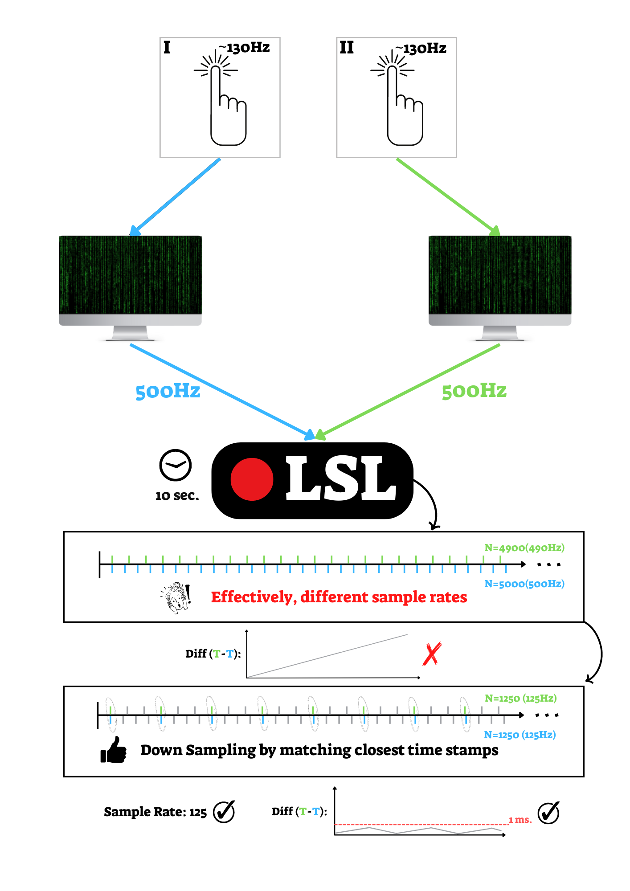
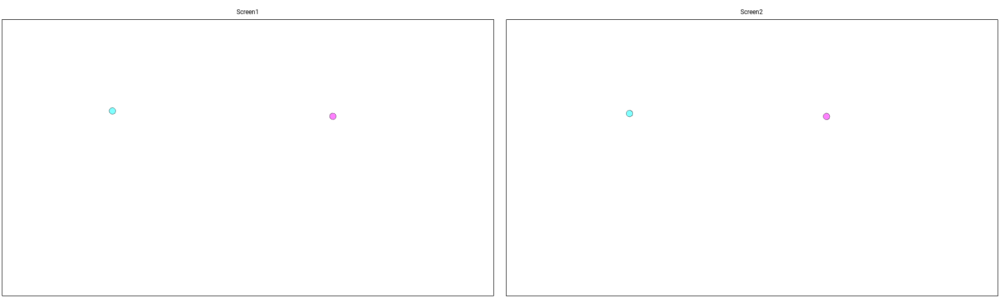
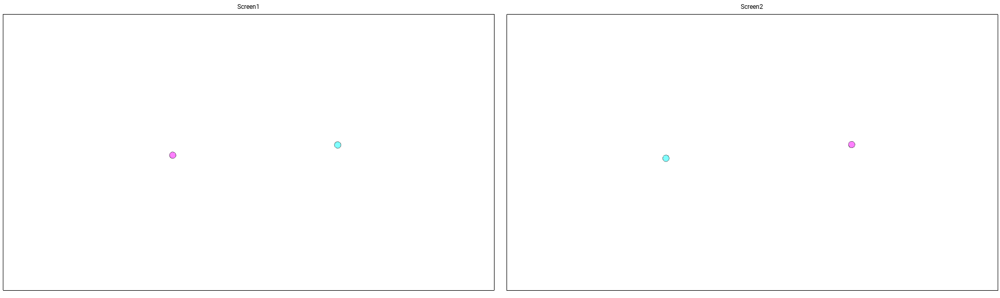
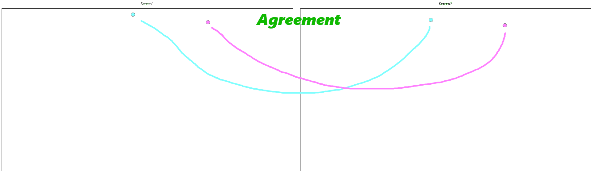
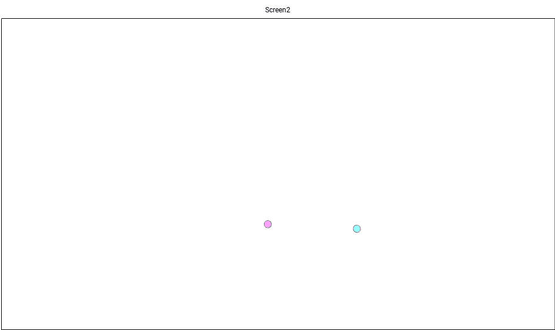

#**Development Section**

The **_Development_** directory includes all the utilities for processing and analyze the data, as well as some analysis references and documentations.

# Inspection Tools
The directory provides some inspection tools that help to investigate the data.

1. **SessionAnimator.py**: Running this file and choose a session to animate. Session can be either `.xdf` file (which are faster to load but unprocessed), or `.xlsx` file (which can be processed data, but tak longer to load).
2. **QualityPlot.py**: Contains a helper method `quality_plot()`, that takes a path to dyadic session directory (i.e. *../d/d025*), and plot an easy-to-interpret information about the session (including the solo tasks).

# Reading & Process the Data
1. **Subject.py** & **Dyad.py**: Each contains a python object for handling every trial from the session - For both dyadic and solo phases. Most of the utilities here using those objects.
2. **xdfFilesUtilities.py**: Helper functions for reading `.xdf` files and convert them to more easy-to-use `.xlsx` dataframe. The method `load_xdf_as_data_frame()` receives a path to .xdf file and convert it to data frames (read the method's doc.). Currently, the process of synchronizing the time series is implemented here. The synchronization is done by down sampling the data and find closest time stamp for each. A demonstration follows:

# Developing Challenges
## Dyadic Post Processing
The file **DyadicPostProcess.py** should contain a post-processing pipeline for the synchronized-data from the dyadic sessions. The current post process pipeline is very basic, and includes:
* Distinguish between left and right and rename columns properly

The main issue we are facing a.t.m are in data, and need to figure out:
1. **Hand Changes**: During the session, a subject often gets his hands very close to each other and then keep them away from each other. In those moments, the application sometimes switches the hands. There are 2 possible cases:
   * Hands were very close, so they collapsed to 1 movement (`TouchChannel.copy` turned to `True`), and the separation (`TouchChannel.copy` turned to `False`) was not correct.
   * The app switches hands without them been copied.

In the figures below, the problem will be clarified.

Let's define `distances` vectors: Simply, we have 4 hands in the system - So all-in-all we have 6 different pairs, and hence 6 distance vectors.
The distance vectors defined in relation to a specific subject.
a `self distance` would be the distance between the hands of a subject.
a `right twin` would be the distance between subject's right hand, and the other subject's left hand (it's twin).
etc...

Let's define `Agreement` between subjects: An `Agreement` is a situation were coupled hands (i.e. sub1's left & sub2's right hands) are recorded on the same channel. This should be the case in the very first sample of the session, where all hands are on the screen, as below:

An `Agreement` example. In the figure you can see that coupled hands are colored the same, which indicates that they are both recorded on the same channel.
Similarly, `Disagreement` is a situation where coupled hands are been recorded on different channels, as in the next figure:

Note that the situations above are very much clear to a naked eye. But in reality there are a lot of spots where the agreement is doubtful... 

In the animation below, you can see an example of the first case of hands-switching: 

In the animation below, you can see the second case of hands-switching (in SlowMotion. Watch carefully):

### What To Do Next?
First we will notice that we don't care about places were *both* subjects were hands-switched. As long there is an `Agreement` between the subjects - we are good. So, we want to maximize to agreements.

In the *DyadicPostProcess.py* file, there is a method called `check_if_subjects_agree()`; Given a samples `a, b`, and `distances` vectors - it checks if there was an agreement **around** `a`, and **around** `b`, and return `True` if both are the same.
Which means, if this method return `False` - Than we need to switch one of the subjects' hands somewhere in `[a,b]`.

Now, we can find all time stamps where a subject's hands are getting close to each other below a threshold, by running the method `intersection_points(dist, TH)` that receives a `self distance` vector, and a threshold `TH`, and return the intersection points of them. 
All the odd-indexed points are where the hands are getting closer to each other, and all the even-indexed points are where the hands are moving away from each other. 

**Approximation Solution** for the hand-switching issue, would be to slowly decrease the threshold, and find the spots where hands-switching occurred. If the threshold is low enough, it might be good solution to switch hands for one of the subject in an arbitrary sample within the range, and reduce the all-in-all disagreements.

**More Accurate Solution** would be, to develop an algorithm that fixes those points of switching hands more analytically. I have started several methods for that in the post process file, but not a great success.

