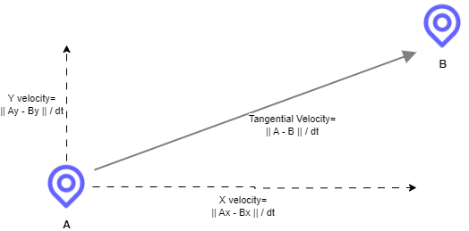
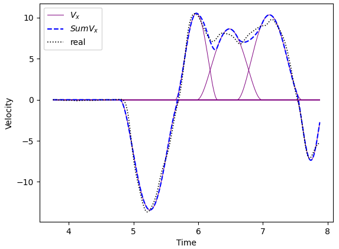

The code here is taken from Jason Friedman's repository. Jason's website:
https://www.curiousjason.com/publications.shtml

A Jason's presentation about this topic located in `JasonFriedmanRepo\matlab\submovements-master\presentations`

# Sub Movement Decomposition
Welcome to the world of sub-movement decomposition!

In this directory you'll be able to find important papers on the subject, as well as code (for Matlab and Python) to perform Sub-Movement Decomposition on a specific task from Jason's lab.

## What is a Movement Exactly?
In order to start talking about Sub movements, it's important to understand what is the movement. In other words - What exactly is our data?

In our context, movement refers to a human-made vector of trajectory over time. The movement can be multidimensional, or 1-d.
If the dimension is `d`, than the trajectory is composed of `d` different vectors that we can calculate their velocities.

The data that we are talking about in the context of sub movements analysis, is the **velocity vector** which is defined simply as `dP / dt`; The distance `dP` that one passes in time of `dt`. 

The velocity vector has `d` components, for each dimension. One can calculate the **Tangential Velocity** that is the 'total 
speed', taking the euclidean distance between two points. Calculating the tangential velocity and calculating each axis' velocity and integrate them - are equal operations.

Tangential velocity and velocities of the axis, also called 'marginal speed'.

## What are Sub Movements?
Now when we have the velocity profile of the movement, we want to somehow analyze it in a fashion that will tell us something about the cognitive, neural processes.

A common method for such analysis is the _Sub Movement Decomposition_; The operation of segmenting the whole movement into smaller, short sub movements.

In order to model the velocity profile as a sub-movements integration, we need to put some assumptions on the velocity.
The assumptions we put are only logical:
1) A movement (human one) begins and ends with zero velocity (which means no-movement).
2) The movement tends to be as smooth as it can be. This is makes sense also in energy costs terms and also considering human's excellent motor performances.

Taking both in consideration, it has shown that there is a specific curve that models such a movement. This curve called **_Minimum Jerk Curve_.** _[Flash & Hogan, 1985]_

A single Min-Jerk curve explains a movement in a straight line, where an addition of several curves can explain a more complex movement. This curve is a polynomial, and is calculated for each dimension and then integrated to a single d-dimensional curve.

Example of 1-d velocity profile decomposition into 5 sub movements. Each of the purple lines is a minimun-jerk curve, the blue line is their sum, and the black line is the original profile. 

## Cognition and Sub-Movements
OK, so we know how to model a movement as a composition of sub movements. What's good in it? 

Well, it appears that the sub movements decomposition involved in some behavioral mechanism, 
such as decision-making process _[Friedman, Brown & Finkbeiner, 2012], [Novak, Miller & Houk, 2001]_ and motor functionality and disorders _[Dounskaia et al. 2009]_.

**In our experiments, we aim to connect one's sub movements decomposition to his spontaneous tempo** as well as to other cognitive phenomenas, such as dyadic synchronization.

## Sub Movements Calculation
As mentioned before, the sub movements decomposition is a set of d-dimensional Minimum-Jerk curves, that their addition is most similar to the original velocity profile.

The best sub movement decomposition can be found using constrained nonlinear optimization algorithms, where the constraints are pre-determined to reflect a feasible human behaviour.
The optimization calculate every axis' curve separately and use the tangential velocity as another constraint.
See _[J. Friedman et al. 2013]_ section _2.5.2_, for clear details about that. 

This calculation takes time. A lot of time [Rohrer & Hogan, 2006]. Hence, most of the analyses are using different **approximations** of the sub movements, such as velocity's peaks&troughs counting or acceleration's zero-crossings.s

For a short, well-defined tasks, another analysis were suggested (In _[Meyer et al. 1988]_, and explained clearly in _[Dounskaia et al. 2009]_). This decomposition treats the submovements as a fixation, and classify them in 3 types - each can be found by either velocity, acceleration or jerk graphs.

### Why not approximation?
There is no reason to not approximate - But of course, it's just an approximation, and it lacks some crucial information, such as the overlapping of the sub movement which points to a decision-making process.
Additionally, the analysis just mentioned above is easy to use in a sterilised, well-defined short task (such as reaching or pointing).
In a more complex movement, such as free motion, it gets more difficult.

### So what do we do?
For the MP data, our options are:

1) For the **Circles** task: We can use the analysis of _Meyer et. al_: We can easily segment this task into shorter, well-defined movements tasks, that are not likely to contain the sub movement of type 1 (read the paper).

2) Use the **amount** of sub movements rather than the exact decomposition. Several ways to do so:
   1) Train an AI-based model to handle the task, as we started to do here in `AI project\submovements`. There are two tasks to fulfill:
   
      1) **_Classification:_** The task of counting how many sub movements there are in a sequence (the length is constant, and the amounts of sub movements are from a pool of integers). The mentioned directory contains a pre-trained model that classifies 4-seconds length sequences into amount of sub movements between 2 and 7 with accuracy of 0.95.
      2) **_Regression:_** The task of finding the parameters of the minimum-jerk curves. This is yet to be done successfully.
    
      Using a good classifier, we can have the amount of sub movements changes over time which can be interesting.
   
   2) Using approximation of acceleration's zero-crossing that grossly points on the amount of sub movements. This is might be good for the dyadic data analysis (It has shown before that it's easy to determine who is the leader/follower using this count).
   
