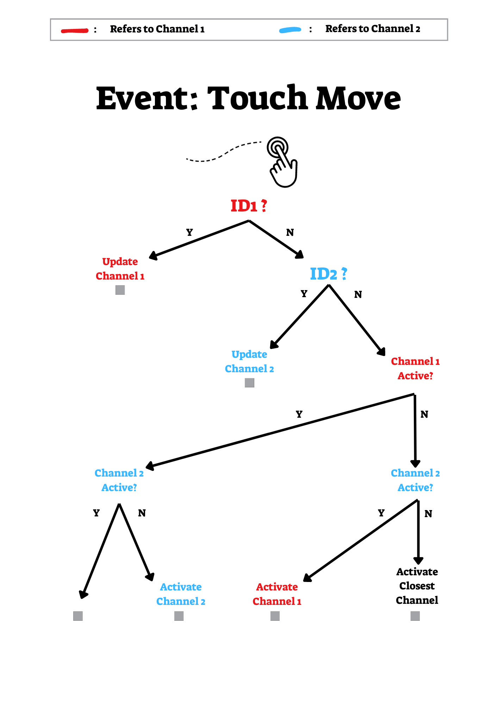
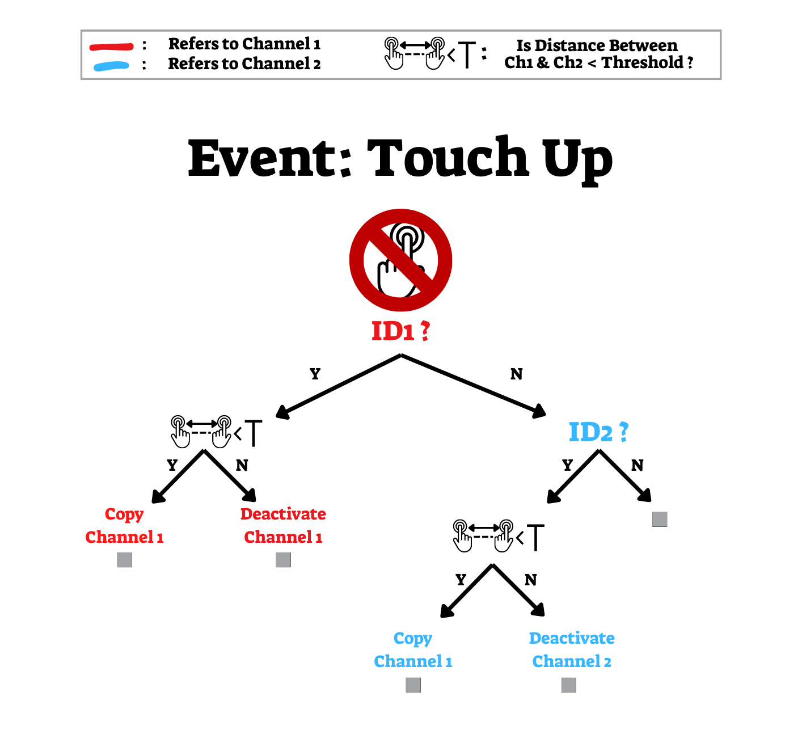

# MirrorPodsWidgetAbs
An abstract object defines the Mirror Pods Widgets functionalities.
### Extensions to more than 2 channels
At the moment, the widgets only support 2 channels (Meanly, 2 different hands on the screen). However, in order to extend this functionality, changes should be made in the abstract's `set_neighbors_channels` method as well as in the widgets event handlers (`on_touch_up`, `on_touch_move`). Additionally, another changed might be made, such as in `TouchChannel.deactivate` method.

# MirrorPodsWidgetDyadic
This is a data-collecting widget (`positional=True`).

The Dyadic widget ignores the event of `uo_touch_down`, which only detects the very first touch moment. Instead, it handles the `on_touch_move` and treats it also as a very-first-touch event.

The behavior of the dyadic widget is a bit complicated to follow in words. The next decision Trees should explain it best:
### On Touch Move:
The event of moving touch detected. A comparison to the existing channels IDs is conducted in order to determine to whom this touch is related to, and the flow continues from there.
If no ID as the touch's ID were found, and yet both of the channels are free - Then choose the closest channel, meanly that it's `last_pos` attribute is closest to touch's position. 

### On Touch Up:
The touch-up event is tricky: Empirically, when two touch events are getting very close to each other, sometimes the firmware detect them as 1 touch event. Hence, the software will detect touch-up event, even-though in fact, there are still 2 hands on the screen.

In this case, in order to record a continuous data, we defined the channel's attribute: `copy`. When `copy=True`, the channel will identify with its nearest neighbor and return everything as its neighbor does. So, even if the channel is seemingly "touched-up", if its `copy` set to `True`, it will collect a valid data. Hence, if a `touch_up` event is occurred, wee check the distance of the related channel from the other channel, and if it smaller than `T` (threshold), we set `copy` to `True`. 
**Important note:** When we set `copy` to `True`, we also deactivate the channel, so when new touch event occurs - This channel will be free to populate it.

# MirrorPodsWidgetSolo
This is a data-collecting widget (`positional=True`).

The Solo widget handles the three kind of events: `on_touch_down`, `on_touch_move`, `on_touch_up`.
Since the solo tasks require only 1 hand, there is always 1 channel free, which may accidentally record noise that is often appears in the very close surrounding of the real touch event.

`groupy` for the rescue: We use TouchChannel's attribute, `groupy`, with very small threshold, to capture these noises and avoid recording them.

The exact flow of this widget is documented in the `MirrorPodsWidgetSolo.py` file.

# SoundsPods
This is **not** a data-collecting widget (`positional=False`).

The widget that in use in the `SoundsApp`.
This widget, in contrast to the data-collection widgets, is designed to send qualitative data (usually to be sent through UDP to MaxMSP), and act like a musical instrument. It aims to imitate a natural feeling of touch on the screen.
Hence, the event handlers are act a bit different from the data-collecting widgets;

1. **Waiting Channel:** The widget define another channel. By default, this channel is inactive, and populated with the first touch event that has no free channel to go to - If any event such as. When one of the regular channels stops, is to be replaced by the waiting channel.
2. `groupy` **With Big Radius:** In order to use the TouchChannel's qualitative attribute `area`, a high threshold for the `groupy` is in use. 

The exact flow of this widget is documented in the `SoundsPods.py` file.