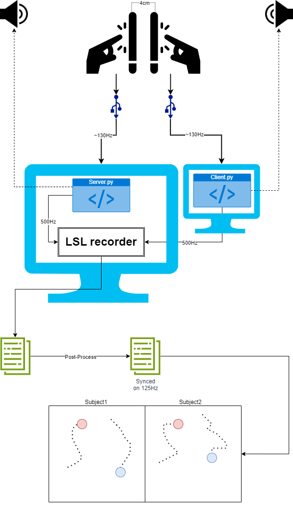

# Diagram Of The Experiment

link to update the diagram: https://drive.google.com/file/d/1QF_zETz2PMW94bG9FQ7TpO3VmFx-Gz6Q/view?usp=sharing

open the file with the suggested "diagram.net" app.

# Files

The **_Tapper_** directory includes the main applications which are:
1. **Server**: The main application runs the whole experiment. This app should run on the same machine as the LSL-Recorder (ATM is _ALMOTUNUI_), while the other machine should run the Client side app.
2. **Client**: The Client side app for _Server_.
2. **AppForSolo**: A reduced version of the main app, which only includes the solo tasks (without the dyadic part).
3. **SoundsApp**: The application that involves soundscapes. This application
4. **RealtimeAnimatorServerApp**: Application for monitoring a movement in real-time. This code should be run on any machine, while the other machine should run the Client side.
5. **RealtimeAnimatorClientApp**: The Client side app for _RealtimeAnimatorServerApp_.

Each application is explained individually in the package itself.

Another files in the directory:
1. **GUI.py**: Contains several modular GUI widgets that are use in more than 1 place.
2. **SoloTasks.py**: Defines the different tasks for the Solo part. Each task is a widget, contains sub-widget object from the _Mirror_Pods_Widgets_.
3. **Factory.py**: A singleton, defines the different Screens of the applications. A Screen is a Kivy's object that we use here to separate the different stages of the experiment.
4. **TouchChannel.py**: The basic object that the widgets in Mirror_Pods_Objects are making use of.
5. **BroadCasters.py**: BroadCasters are objects that send the data to a specific client, i.e: Print it, send to UDP client, etc...
6. **utils.py**: Global parameters and other utilities.

The **_Data_** directory contains the data recorded from the experiments.
The **_Mirror_Pods_Widgets_** package contains the different widgets that the application use. A widget is a Kivy's object that handles Touch Events.

# Structure and Logic of the Apps

### Structure (OOP-wise)
The structure of the application will be more understood after you practice the Kivy framework, using the exercise section under the `Development` directory. However, this is the basics:
* Every task is implemented as a Kivy's `Widget`, which can handle touch events. Since all tasks have some things in common - an abstract `Task` is implemented. Inside the children widget, the touch events handled to fulfill the specific task goal. Most of the widgets use `TouchChannel` objects to trace to touch events. A widget handles its own sampling operation, meanly timer that record data every `1/srate`.
* Every such task, is wrapped by a `Screen` object. Those handle the initiation and ending of the task and recordings, and also count the timers for the specific tasks they handle.
* However, in fact there are more Screens than Tasks: For a subject registration, Menu of tasks, Dyadic instruction, Exit, etc. All of these do not wrap any task, but present a GUI functionality.
* The main App object defines the different tasks (Widgets) and Screens and create their instances. It also establishes the connection between the CPUs, and to the LSL. Additionally, it creates a `Context` object instance, to save information about the experiment and handle the logic.
* So the basic structure can be described as follows:
  * **App:**
    * *Context*: info & logics
    * *Connections*
    * _**ScreenManager:**_
      * *Non-task Screens:* GUI and black screens
      * _**Tasks Screens**_
        * *Task Meta:* duration, start, stop
        * _**Widget:**_
          * The implementation of the task itself

### Logic
The logic of the experiment is supported by the `Context` object, that save all the information (on the fly) and trace the stages of the experiment.

Please be noticed that the logic implementation is a bit cumbersome. If a minor changes should be done - It is best to not involve the `Context` objects.

**Context:** Handle the main next issues: 
* **Comfy workflow**. (i.e, let the second subject arrive after 40 minutes), the registration of the subjects should be separated.
In order to do that, we defined a Screen contains GUI of registration, before every subjects' solo tasks. The *context* handle the information that is being received on the fly.
* **Versatility**. the tasks' Timers are not hard-coded. This is very helpful for debugging. In order to support that, the *Context* receives the information from the user's input, and save it.
* **Order of the experiment**. Several `states` were defined as successive integers, and every state holds for stage during the experiment. The Context's `next_state` and `prev_state` functions should handle this logic.
  